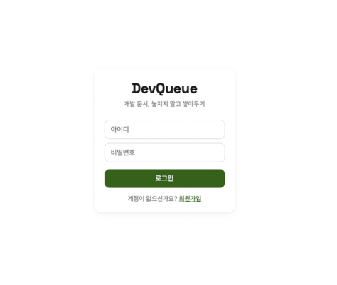
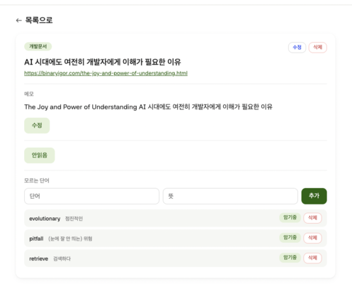
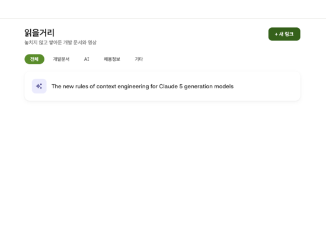
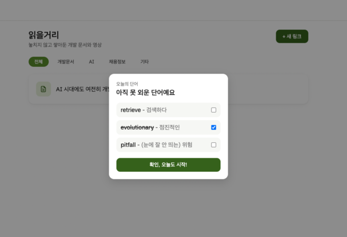

# 📚 DevQueue

개발 문서/영상을 카테고리별로 저장하고, 모르는 단어를 등록해 매일 랜덤으로 복습하는 개인용 읽을거리 큐 + 단어장 서비스입니다. <br />
A personal reading-queue and vocabulary app that saves dev articles/videos by category, and lets you review random unknown words once a day.

**🔗 배포 링크 / Live demo: [devqueue.duckdns.org](http://devqueue.duckdns.org)**

<table>
  <tr>
    <td></td>
    <td></td>
  </tr>
  <tr>
    <td></td>
    <td></td>
  </tr>
</table>

> Java/Spring Boot를 학습하며 진행한 개인 프로젝트입니다. RPI(Research–Plan–Implement) 워크플로로 AI와 함께 설계하고, 모든 구현 코드는 직접 작성했습니다. <br />
> A personal project built while learning Java/Spring Boot. Designed with AI using the RPI (Research–Plan–Implement) workflow; all implementation code was written by hand.

---

## 💡 왜 만들었나 / Why I built this

평소 유용한 개발 문서나 영상을 저장해두고 읽거나 시청하면서 기술 공부와 영어 공부를 함께 하는 것을 좋아합니다. <br />
그런데 링크를 계속 여러 군데 메모해두다 보니 필요한 링크를 찾기가 어렵거나 저장해두고 잊어버릴 때가 많았습니다.

Java + Spring 공부를 하면서 실습할 겸, 평소에 필요했던 작은 서비스를 만들며 공부해보면 어떨까 생각해서 시작하게 되었습니다.

카테고리별로 링크를 정리해서 저장하고, 읽으면서 모르는 단어는 바로 기록해뒀다가, 매일 팝업을 띄워 자연스럽게 복습하는 개인용 도구를 만들었습니다.

Java/Spring 기초는 김영한 님의 스프링 강의로 다졌고, 이후 RPI 워크플로 설계·인증·JPA 전환·AWS 배포·CI/CD는 직접 확장했습니다.

I like saving useful dev articles and videos to read or watch, combining tech learning with English study. But scattering links across multiple notes made them hard to find, and I often forgot I'd even saved them.

While studying Java + Spring, I thought it'd be a good way to practice by building a small tool I actually needed.

So I built a personal tool that organizes links by category, lets me jot down unknown words while reading, and surfaces a daily popup to review them naturally.

Java/Spring fundamentals were built through Kim Young-han's Spring course; everything beyond that — RPI workflow design, authentication, JPA migration, AWS deployment, and CI/CD — was extended independently.

---

## 🛠️ 기술 스택 / Tech Stack

**Backend**
- Java 17, Spring Boot 4.1.1, Gradle
- Spring MVC, Thymeleaf
- Spring Data JPA, MySQL 8
- Spring Security Crypto (BCrypt)

**Infra / DevOps**
- AWS EC2 (Amazon Linux 2023), AWS RDS (MySQL)
- GitHub Actions (Checkstyle + SpotBugs)
- DuckDNS

**Dev Process**
- RPI (Research–Plan–Implement) workflow
- Git branching strategy — one feature branch + PR per Phase

---

## 🎮 주요 기능 / Key Features

| 한글 | English |
|---|---|
| 회원가입 / 로그인 (세션 기반 인증, BCrypt 암호화) | Sign up / log in (session-based auth, BCrypt hashing) |
| 개발 문서/영상 링크 저장 (제목·URL·카테고리·메모) | Save dev article/video links (title, URL, category, memo) |
| 카테고리 필터링 (개발문서 / AI / 채용정보 / 기타) | Filter by category (Dev Docs / AI / Jobs / Etc) |
| 문서별 모르는 단어 등록·삭제·암기 여부 토글 | Add/delete words per article, toggle memorized status |
| 매일 처음 접속 시 안 외운 단어 중 랜덤 3개 팝업, 체크한 단어만 암기 완료 처리 | Once a day, on first visit, a popup shows 3 random unmemorized words; only checked ones are marked memorized |
| 문서 읽음 여부 토글, 수정/삭제 | Toggle read status, edit/delete articles |
| 본인이 등록한 데이터만 조회 가능 (소유권 검증) | Only the owner can view their own data (ownership check) |

---

## 📐 개발 프로세스 / Development Process

**RPI(Research → Plan → Implement) Claude code 워크플로**를 커스터마이징해서 사용했습니다. <br />
I customized the **RPI (Research → Plan → Implement) Calude code workflow** for this project.

- **Research / Plan**: Claude Code로 요구사항을 분석하고 `pm.md`(요구사항) / `ux.md`(화면 흐름) / `eng.md`(기술 설계) / `PLAN.md`(Phase별 실행 계획)로 문서화 <br />
  Analyzed requirements with Claude Code and documented them as `pm.md` (requirements), `ux.md` (UX flows), `eng.md` (technical design), and `PLAN.md` (phase-by-phase execution plan).
- **Implement**: 모든 코드는 미션 단위로 직접 작성하며 학습 <br />
  Every line of code was written by hand, mission by mission, as a learning exercise.

→ 설계 문서 전체 / Full design docs: [`rpi/article-vocab-tracker/`](./rpi/article-vocab-tracker/)

이렇게 나눈 이유는, 학습 단계이기 때문에 효과를 극대화하기 위해 직접 작성해보며 익숙해지기 위해서였습니다. <br />
설계(Research/Plan)는 AI와 함께하되, 실제 구현은 개념을 하나씩 미션으로 받아 직접 작성하는 방식으로 진행했습니다. <br />

The reason for this split: since this was a learning project, writing every line myself and getting hands-on with each concept was the best way to actually absorb it. So design (Research/Plan) was done with AI, while implementation was done by receiving concepts as missions and writing every line by hand.

---

## 📝 개발 히스토리 (Phase별) / Development History (by Phase)

각 Phase는 별도 브랜치 + PR로 진행했습니다. <br />
Each phase was developed on its own branch and merged via PR.

| Phase | 내용 / What | 핵심 학습 개념 / Key Concepts |
|---|---|---|
| 0 | 스캐폴딩 + CI 세팅 / Scaffolding + CI setup | `@Controller`, Thymeleaf, GitHub Actions (Checkstyle/SpotBugs) |
| 1 | 도메인 모델 + 메모리 Repository / Domain model + in-memory repository | Interface design, `Optional`, plain JUnit vs `@SpringBootTest` |
| 2 | 아티클 CRUD / Article CRUD | `@PostMapping`, POST-Redirect-GET, domain methods for state changes |
| 3 | 카테고리 필터 / Category filter | Enum `@RequestParam`, Stream API, service-layer responsibility |
| 4 | 인증 + 소유권 / Auth + ownership | `HttpSession`, BCrypt, `HandlerInterceptor`, DTOs, ownership checks |
| 5 | 단어(Vocabulary) 관리 / Vocabulary management | FK-based 1:N relations, 1:N query methods |
| 6 | 단어 암기 팝업 / Vocabulary memorization popup | Combining multiple repositories, random sampling, date-based state |
| 7 | 스타일링 + 수정/삭제 / Styling + edit/delete | Custom CSS design system, inline JS, completing Article CRUD |
| 8 | JPA + MySQL 전환 / JPA + MySQL migration | `@Entity`, Spring Data JPA, `@Profile` swapping, `@Transactional` |

**Phase 8의 핵심 성과 / Key outcome of Phase 8**: Phase 1에서 설계한 Repository 인터페이스 덕분에, 메모리 구현체 → JPA/MySQL 구현체로 전환하면서 **Controller/Service 코드를 한 줄도 바꾸지 않았습니다.** <br />
Thanks to the repository interfaces designed in Phase 1, switching from the in-memory implementation to JPA/MySQL required **zero changes to Controller/Service code.**

---

## 🐛 겪은 이슈와 해결 (일부) / Issues & Fixes (selected)

- **MySQL 예약어 충돌 / MySQL reserved word conflict**: `read`가 예약어라 컬럼 생성 실패 → `@Column(name = "is_read")`로 매핑 분리 <br />
  `read` is a reserved word, so table creation failed → mapped it explicitly with `@Column(name = "is_read")`.
- **JPA dirty checking 미반영 / JPA dirty checking not applying**: 메모리 구현체는 참조 공유로 필드 변경이 즉시 반영됐지만, JPA는 트랜잭션 경계 밖에서는 변경이 감지되지 않음 → 상태 변경 메서드에 `@Transactional` 추가  <br />
  The in-memory repository shared object references, so field changes applied instantly; JPA only detects changes inside a transaction → added `@Transactional` to all state-mutating methods.
- **세션 객체와 DB 재조회 객체가 별개 인스턴스인 문제 / Session object vs. re-fetched DB object being separate instances**: 로그인 팝업 날짜 갱신 시 DB 반영과 세션 객체 갱신을 모두 처리하도록 수정  <br />
  Fixed the login-popup date update to sync both the DB and the in-session object.
- **RDS 보안 그룹 미설정으로 EC2 연결 실패 / EC2 couldn't reach RDS due to missing security group rule**: RDS 인바운드 규칙에 EC2 보안 그룹을 추가해 해결  <br />
  Resolved by adding the EC2 security group to the RDS inbound rules.

---

## 🚀 배포 아키텍처 / Deployment Architecture

```
사용자 / User → devqueue.duckdns.org
              ↓
        EC2 (Amazon Linux 2023, Java 17, Spring Boot)
              ↓ (VPC 내부 통신 / internal VPC traffic)
        RDS (MySQL 8, Single-AZ)
```

- EC2에서 `nohup`으로 애플리케이션을 백그라운드 실행해 SSH 세션 종료 후에도 유지  <br />
  Runs the app in the background with `nohup` on EC2, so it stays up after the SSH session ends.
- DuckDNS로 무료 서브도메인 연결, 80번 포트로 포트 번호 없이 접근 가능  <br />
  Connected a free subdomain via DuckDNS, serving on port 80 so the URL needs no port number.

---

## 🔮 다음 계획 (v2 이후) / Roadmap (v2+)

- 개발자 유형(프론트/백엔드/기타)별 인기 링크 랭킹 / Popular-link rankings by developer role (Frontend/Backend/Etc)
- Gmail OAuth2 소셜 로그인 추가 / Gmail OAuth2 social login
- Category 동적 관리 (현재는 Enum 고정) / Dynamic category management (currently a fixed Enum)
- RDS 퍼블릭 액세스 비활성화 + Bastion Host 패턴 적용 / Disable RDS public access + adopt a Bastion Host pattern (security hardening)
- 도메인 동적 IP 대응, HTTPS(SSL 인증서) 적용 / Handle dynamic IP for the domain, add HTTPS (SSL certificate)

---

## 📁 프로젝트 구조 / Project Structure

```
dev-queue/
├── rpi/article-vocab-tracker/   # RPI 워크플로 설계 문서 / RPI workflow design docs
├── src/main/java/com/areumz/devqueue/
│   ├── domain/                  # Article, User, Vocabulary, Category, Role
│   ├── repository/              # 인터페이스 + memory/jpa 구현체 / interfaces + memory/jpa implementations
│   ├── service/
│   ├── controller/
│   └── config/                  # SecurityConfig, WebConfig, LoginCheckInterceptor
├── src/main/resources/
│   ├── templates/                # Thymeleaf views
│   └── static/css/               # custom styles
└── .github/workflows/ci.yml     # Checkstyle + SpotBugs
```

---

## 🏃 로컬 실행 방법 / Running Locally

```bash
git clone https://github.com/areumz/dev-queue.git
cd dev-queue

# application-local.properties.example 참고하여
# application-local.properties 생성 (DB 정보 입력)
# Copy application-local.properties.example to
# application-local.properties and fill in your DB credentials

./gradlew bootRun
```